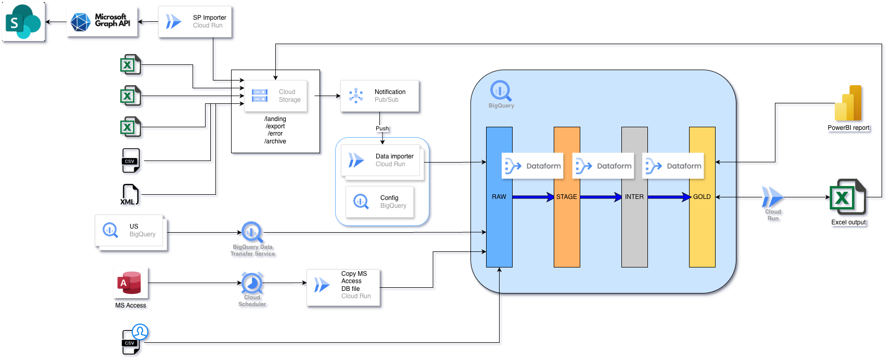

# Ford GCP Training – Volume 3

<p align="center">
  
</p>

## Overview

This repository contains the hands-on exercises used during the third GCP training for the Ford data team.

The primary goal of the training is to demonstrate how existing Alteryx workflows can be migrated to a modern Google Cloud Platform architecture using native GCP services.

The training is designed for analysts and data professionals with limited cloud engineering experience. The exercises focus on understanding the architecture, the responsibilities of each component and the interaction between them.

The examples are based on real-world workflows currently using:

- Excel files
- SharePoint
- BigQuery
- Alteryx

The target architecture uses:

- Cloud Storage
- Pub/Sub
- BigQuery
- Dataform
- Cloud Run
- Cloud Scheduler
- BigQuery Data Transfer Service
- Cloud Composer (Airflow)

---

# Training Goal

By the end of the training participants will understand how a typical Alteryx workflow can be implemented using Google Cloud services.

The final architecture will resemble the following:

```text
SharePoint / Excel / CSV / XML / MS Access / BigQuery sources
                     ↓
              Ingestion services
        Cloud Storage, Cloud Run, DTS
                     ↓
                  BigQuery RAW
                     ↓
                  Dataform
                     ↓
          STAGE → INTERMEDIATE → GOLD
                     ↓
          Power BI report / Excel export
```

Cloud Composer (Airflow) will orchestrate the complete process.

At a high level, the diagram shows three ingestion patterns:

- SharePoint files are accessed through Microsoft Graph API and imported into Cloud Storage.
- File arrivals in Cloud Storage can trigger Pub/Sub notifications, which then start Cloud Run-based import logic.
- Existing BigQuery and MS Access sources can be loaded into the RAW layer through BigQuery Data Transfer Service, Cloud Scheduler and Cloud Run jobs.

Inside BigQuery, Dataform owns the transformation flow from RAW to STAGE, INTERMEDIATE and GOLD datasets. The GOLD layer is then consumed by Power BI reports or exported back to Excel through Cloud Run.

---

# Training Structure

The training consists of four half-day sessions.

## Day 1

### Cloud Storage & Pub/Sub

Topics:

- Cloud Storage
- Landing Zone design
- Bucket structure
- Event-driven architecture
- Pub/Sub fundamentals

Hands-on exercises:

- Create a personal bucket
- Create enterprise folder structure
- Upload Excel files
- Create Pub/Sub topics
- Create subscriptions
- Configure Cloud Storage notifications
- Generate and inspect Pub/Sub events

End result:

```text
Excel
   ↓
Cloud Storage
   ↓
Pub/Sub
   ↓
Message
```

---

## Day 2

### BigQuery & Dataform

Topics:

- Data warehouse fundamentals
- Raw / Staging / Intermediate / Gold layers
- BigQuery datasets
- Tables and views
- Dataform
- Dataform vs dbt

Hands-on exercises:

- Create datasets
- Create external tables
- Create native tables
- Create views
- Build Dataform models
- Create transformations
- Create a Gold table

End result:

```text
Excel
   ↓
Cloud Storage
   ↓
BigQuery Raw
   ↓
Dataform
   ↓
Gold Table
```

---

## Day 3

### Cloud Run

Topics:

- Serverless compute
- Cloud Run Services
- Cloud Run Jobs
- Event-driven processing
- Python-based integrations

Hands-on exercises:

- Deploy a Cloud Run service
- Read Excel files
- Load data into BigQuery
- Export data from BigQuery
- Connect Pub/Sub events to Cloud Run

End result:

```text
Excel
   ↓
Cloud Storage
   ↓
Pub/Sub
   ↓
Cloud Run
   ↓
BigQuery
```

---

## Day 4

### Cloud Composer (Airflow)

Topics:

- Workflow orchestration
- DAGs
- Scheduling
- Monitoring
- Error handling
- Retry strategies

Hands-on exercises:

- Create Airflow DAGs
- Trigger Cloud Run
- Trigger Dataform
- Monitor execution
- Build an end-to-end pipeline

End result:

```text
Excel
   ↓
Cloud Storage
   ↓
Pub/Sub
   ↓
Cloud Run
   ↓
BigQuery
   ↓
Dataform
   ↓
Gold Layer
   ↓
Export
```

---

# Repository Structure

```text
ford-training-vol3
│
├── README.md
│
├── day1-storage-pubsub
│   ├── 01-create-bucket.md
│   ├── 02-create-folder-structure.md
│   ├── 03-upload-excel.md
│   ├── 04-create-topic.md
│   ├── 05-create-subscription.md
│   └── 06-create-notification-and-test.md
│
├── day2-bigquery-dataform
│   ├── 01-create-datasets.md
│   ├── 02-load-raw-tables.md
│   ├── 03-explore-data.md
│   ├── 04-create-dataform-repository.md
│   ├── 05-create-stage-models.md
│   ├── 06-create-intermediate-model.md
│   ├── 07-create-gold-model.md
│   ├── 08-run-dataform.md
│   ├── materials
│   │   ├── dealer_master.csv
│   │   ├── mli_mapping.csv
│   │   └── sales_data.csv
│   └── theory
│       ├── 01-bq-deep-dive.md
│       ├── 02-dataform-deep-dive.md
│       └── 03-dataform-repo-workspace.md
│
├── day3-cloudrun
│   ├── 01-create-cloudrun-service.md
│   ├── ...
│
└── day4-composer
    ├── 01-create-composer-environment.md
    ├── ...
```

---

# Prerequisites

Participants should have:

- Access to the training GCP project
- Editor permissions
- A Google account
- Basic understanding of SQL
- Basic understanding of Excel

No prior experience with:

- Cloud Run
- Dataform
- Composer
- Pub/Sub

is required.

---

# Training Project

Project ID:

```text
ford-training-430008
```

All exercises in this repository assume that participants are working inside this project.

---

# Important Note

The exercises intentionally focus on understanding the architecture rather than building production-ready solutions.

Many enterprise topics such as:

- CI/CD
- Terraform
- Secret Manager
- IAM best practices
- Monitoring
- Cost optimization
- Security hardening

are simplified in order to keep the focus on the migration journey from Alteryx to GCP.

The objective is to understand:

- Which GCP component solves which problem
- How the components interact
- How an Alteryx workflow maps to a cloud-native architecture

---

# Learning Outcome

After completing the training, participants should be able to:

- Understand the target GCP architecture
- Ingest files into Cloud Storage
- Process events with Pub/Sub
- Store and transform data in BigQuery
- Build Dataform pipelines
- Execute Python workloads in Cloud Run
- Orchestrate workflows with Airflow
- Understand how existing Alteryx workflows can be migrated to GCP

---

# Architecture Summary

```text
SharePoint / Excel / CSV / XML / MS Access / BigQuery
                    ↓
          Cloud Storage / Cloud Run / DTS
                    ↓
                BigQuery RAW
                    ↓
                 Dataform
                    ↓
       STAGE → INTERMEDIATE → GOLD
                    ↓
          Power BI / Excel Export

Cloud Composer (Airflow)
        orchestrates
     the entire flow
```
